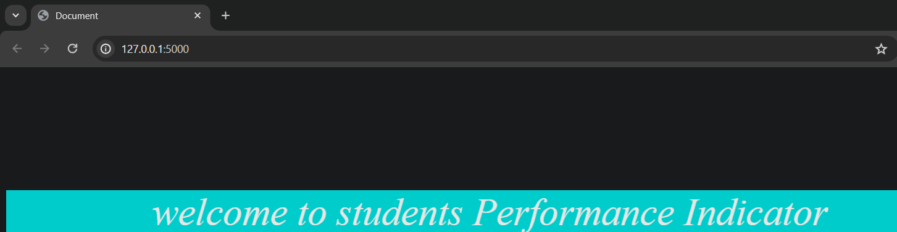
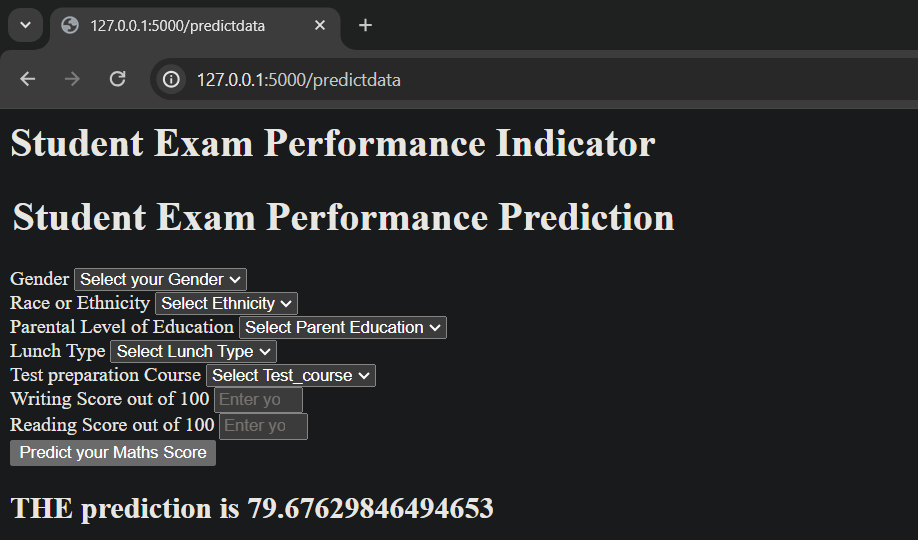
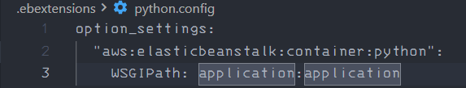
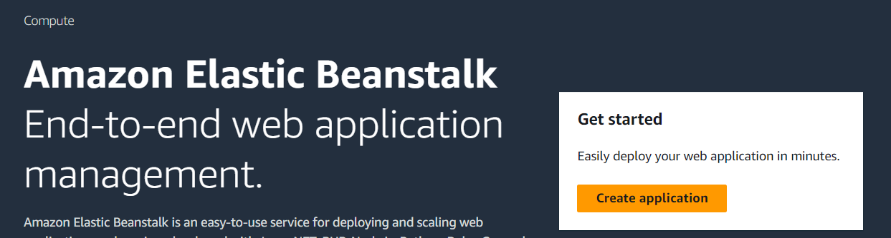
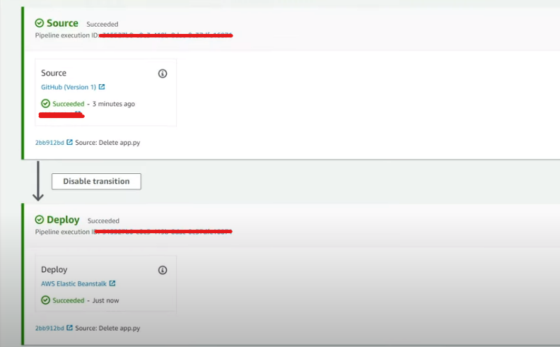

### An end2end Project which can be accessed locally to predict new data.
 

 

 

### Now to deploy it in AWS 

Step1:
>create a <i>".ebextensions"</i>  directory in your parent directory. 

Step2: 
>create a  <i>"python.config"</i>  file inside the newly created directory and edit it to look like this:
>>   

Step3: 
Log onto your Amazon console. 
> Search for <strong>ElasticBeanStalk </strong> and click on create application  
>>  

>Enter the details and hit create application, now skip to review and create the environment.  

>Search for <i>"codepipeline"</i> and click create pipeline, Enter tha name of pipeline and add the source i.e., your github repo url. and after entering details ahead the repo will be deployed. 
>>

